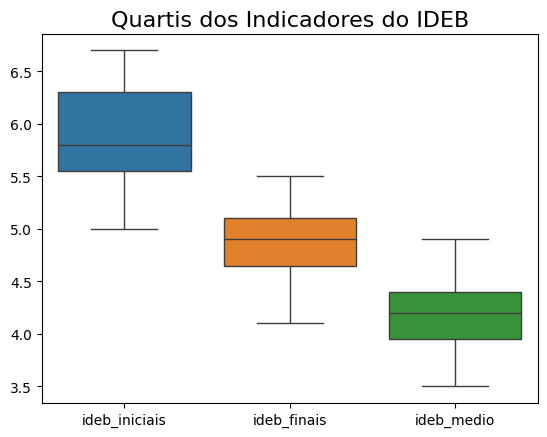
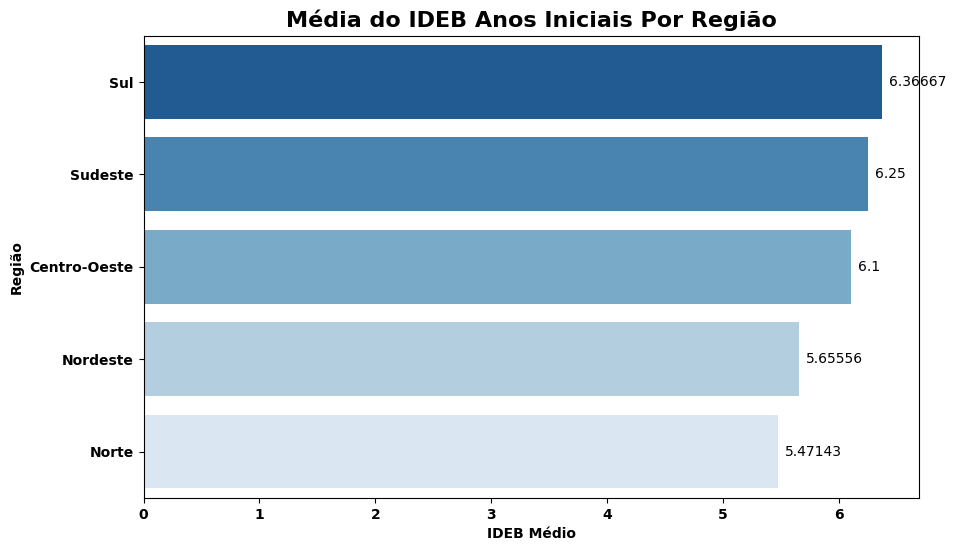
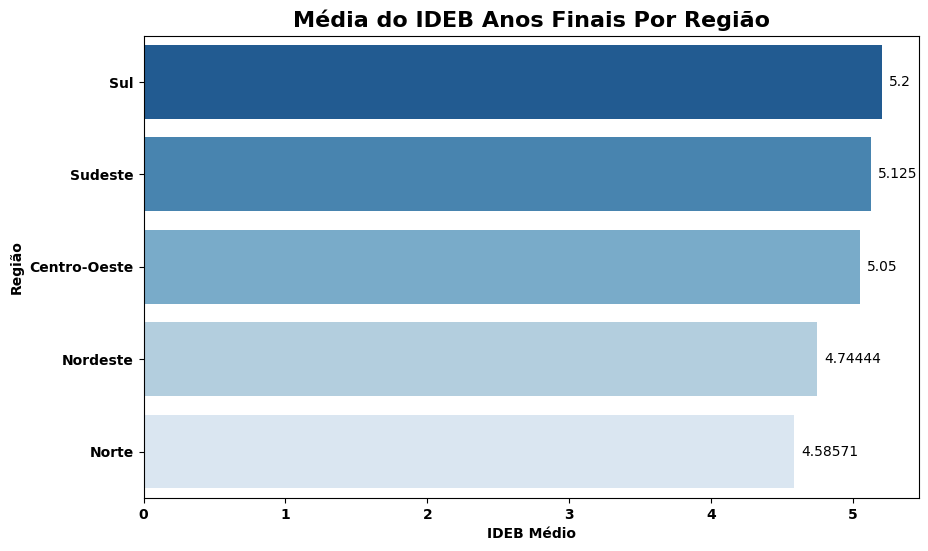
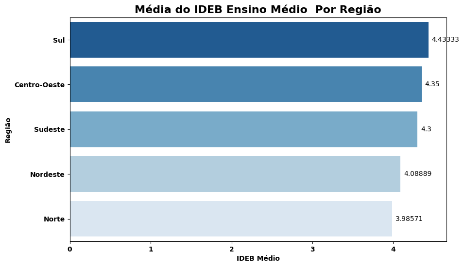
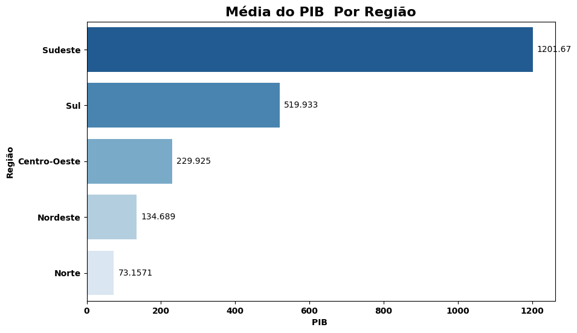
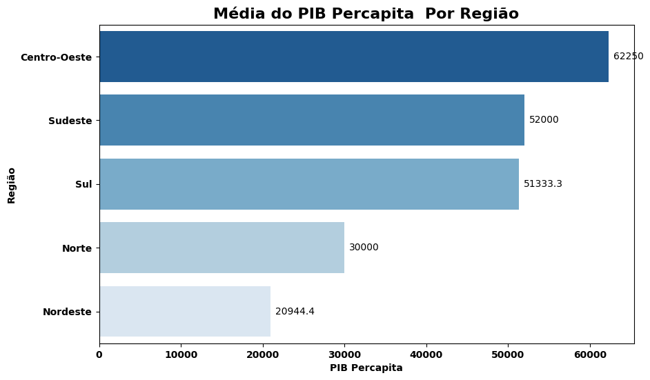
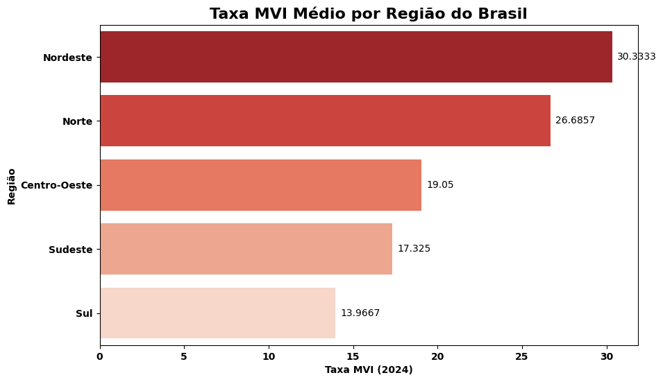
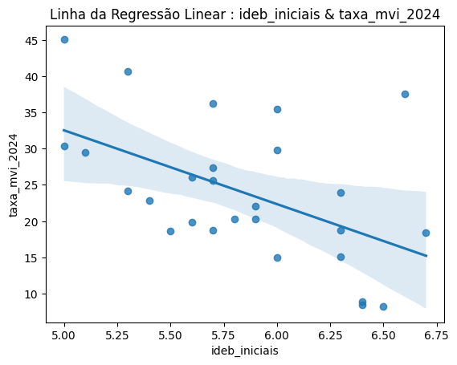
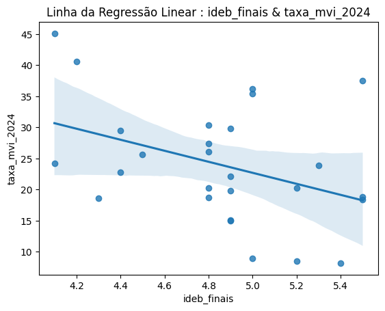
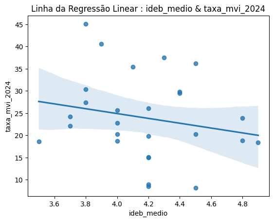

Data Analytics – Indicadores Educacionais e Sociais

## Visão geral
Este projeto analisa indicadores educacionais (IDEB) e sua relação com fatores socioeconômicos (PIB) e de segurança (Taxa MVI) no Brasil.

## Tecnologias usadas
* **Python**
* **Jupyter Notebook / Google Colab**
* **Pandas**
* **Matplotlib**
* **Seaborn**

---

## Análises e Visualizações

### 1. Distribuição dos Indicadores IDEB

**Descrição:** Boxplot comparando a distribuição das notas. O desempenho decresce conforme as etapas avançam (Iniciais > Finais > Médio).

### 2. Desempenho Regional (IDEB)

**Descrição:** Médias por região. Sul e Sudeste lideram os índices, enquanto Norte e Nordeste apresentam os maiores desafios.

### 3. Indicadores Socioeconômicos (PIB)

**Descrição:** Disparidade econômica regional. O Sudeste possui o maior PIB total e o Centro-Oeste o maior PIB per capita.

### 4. Taxa de Mortes Violentas Intencionais (MVI)

**Descrição:** O Nordeste e o Norte apresentam as taxas de violência mais elevadas do país em 2024.

### 5. Regressão Linear: Educação vs. Violência

**Descrição:** As linhas de tendência indicam que quanto maior o IDEB, menor tende a ser a taxa de violência (MVI) na região.

---

## Conclusões
Os dados demonstram que o desempenho educacional está fortemente atrelado ao contexto socioeconômico e regional.

---
Projeto para demonstração de competências em ciência de dados e estatística.
